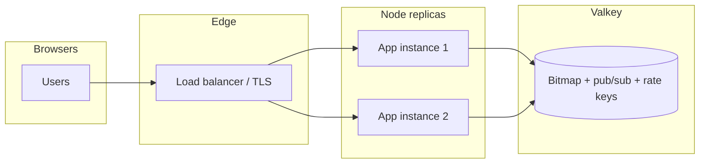
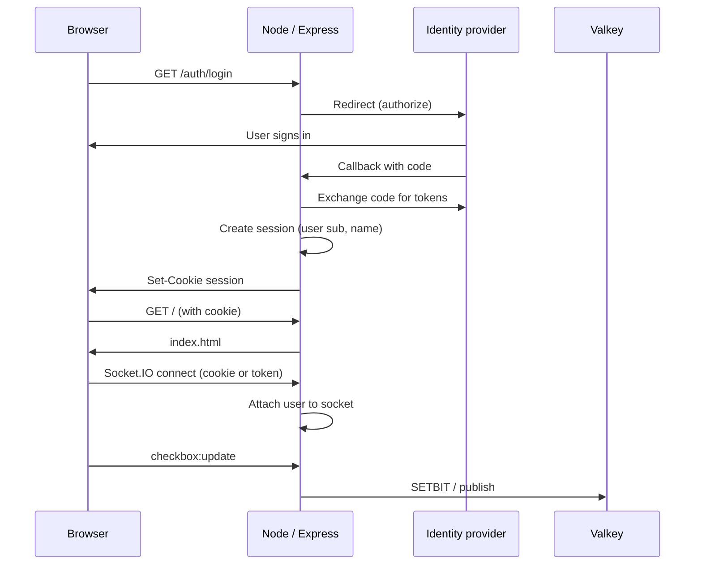
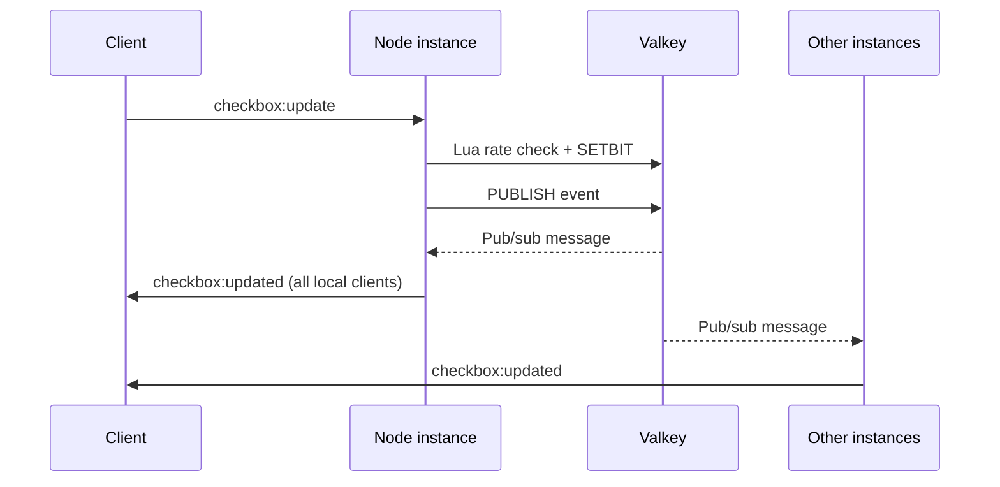

# One Million Checkbox

Real-time collaborative checkbox grid backed by **Valkey** (bitmap state + pub/sub + distributed rate limits). The browser renders a **virtualized canvas** grid: the number of columns is computed from the viewport width (`floor(width / cellSize)`), so the sheet fits without horizontal scrolling and you scroll **vertically** through rows only.

---

## Tech stack

| Layer | Technology |
|--------|------------|
| Runtime | Node.js (ES modules) |
| HTTP / static UI | Express 5 |
| Real-time transport | Socket.IO (WebSockets + fallback) |
| Shared state & messaging | Valkey / Redis protocol (`ioredis`): bitmap (`SETBIT`/`BITCOUNT`), pub/sub for broadcasts, Lua rate limiting |
| Container (local Valkey) | Docker Compose (`valkey/valkey`) |
| Configuration | `dotenv`, `.env` |

Optional additions when you add authentication or scale further:

| Concern | Typical choice |
|---------|----------------|
| OIDC / OAuth2 sign-in | `passport` + `passport-openidconnect` (or provider SDK), or Auth.js / custom OAuth flow |
| HTTP session after OIDC | `express-session` + Redis/Valkey session store so sessions work across instances |
| Socket.IO across multiple servers | `@socket.io/redis-adapter` (or sticky sessions + same pub/sub pattern you already use for events) |

---

## Do you need a folder structure beyond `index.js`?

**No, not strictly.** A single `index.js` plus `public/` is fine for this size of project.

Splitting into folders becomes worthwhile when you grow beyond one server file (for example):

- `src/server.js` — HTTP server, Socket.IO, middleware wiring  
- `src/valkey.js` — Redis clients, bitmap helpers, Lua scripts  
- `src/socket/handlers.js` — connection / checkbox / bitmap handlers  
- `middleware/auth.js` — OIDC callbacks, session checks  

Until then, keeping `index.js` at the repo root is normal and keeps deployment simple (`node index.js`).

---

## Project structure (current)

```
one-mil-checkbox/
├── index.js              # Express app, Socket.IO, Valkey (bitmap, pub/sub, rate limit Lua)
├── package.json
├── pnpm-lock.yaml
├── docker-compose.yml    # Local Valkey for development
├── .env                  # Local secrets (not committed)
├── .env.example          # Documented variables
├── public/
│   └── index.html        # Canvas UI, Socket.IO client, activity log
└── README.md
```

**Suggested structure later** (when adding OIDC tests or routes):

```
src/
  server.js
  routes/
    auth.js               # /login, /oauth/callback, /logout
middleware/
  requireAuth.js          # optional for HTML vs API
public/
  index.html
```

---

## How hosting fits together



- **Static assets + Socket.IO** are served by each Node process (or put a CDN in front for static files only; WebSockets still hit Node).
- **Valkey** holds the checkbox bitmap and propagates updates via **pub/sub** so every instance broadcasts the same events.
- **Rate limits** use Valkey + Lua so limits stay consistent across replicas.

---

## OIDC login: how it would work with this app

OIDC runs over **normal HTTPS requests** (redirect to IdP, callback with code, exchange for tokens). Socket.IO is separate but can reuse the same identity.

### Recommended pattern

1. **OIDC on Express**  
   Add routes such as `/auth/login`, `/auth/callback`, `/auth/logout` using your IdP (Azure AD, Okta, Keycloak, Google, etc.). After a successful callback, store the user profile (at minimum `sub`, and optionally `name`, `email`) in a **server-side session** (`express-session`) or issue a **signed HTTP-only cookie / JWT** that your API trusts.

2. **Protect the UI**  
   Either serve `public/index.html` only when authenticated (middleware checks session before `sendFile`), or serve a small login shell and load the app after login.

3. **Socket.IO authentication**  
   The browser does not automatically send cookies to Socket.IO in all setups; the usual approach is:
   - **Auth handshake**: `io({ auth: { token } })` where `token` is a short-lived JWT or session token obtained from `/auth/session` after OIDC, **or**
   - Enable cookie-based auth and configure Socket.IO + CORS/credentials so the session cookie is sent on the handshake.

   On the server, use `io.use((socket, next) => { ... validate token/session ...; socket.user = profile; next(); })`. Reject unauthenticated connections if you want the grid private.

4. **Use stable identity in events**  
   Today the UI sends a free-text `user` string. With OIDC, set `user` from claims (for example `sub` or email) on the server when handling `checkbox:update`, so activity logs show real identities and rate limits can key off `sub` instead of only `socket.id` if you choose.

### OIDC + session sequence (conceptual)



### Rate limiting and logged-in users

Right now rate keys are **`checkbox:rate:{socketId}`**. After OIDC you may switch to **`checkbox:rate:{sub}`** (subject claim) so one human has one limit across reconnects and tabs, if that matches your product rules.

---

## Data flow (checkbox update)



---

## Project setup

### Prerequisites

- Node.js 18+ recommended  
- [pnpm](https://pnpm.io/) (see `packageManager` in `package.json`)  
- Docker (optional, for local Valkey)

### Install

```bash
pnpm install
```

### Environment

Copy `.env.example` to `.env` and adjust:

| Variable | Purpose |
|----------|---------|
| `PORT` | HTTP port |
| `VALKEY_URL` | Valkey/Redis URL (`redis://host:6379`) |
| `CHECKBOX_COUNT` | Logical checkbox count (default 1_000_000) |
| `CHECKBOX_RATE_MS` | Minimum milliseconds between attempts per socket (default 5000) |
| `VALKEY_RATE_PREFIX` / `VALKEY_RATE_TTL_SEC` | Rate-limit key prefix and TTL |

### Run Valkey locally

```bash
pnpm valkey:up
```

### Run the app

```bash
pnpm start
```

Open `http://localhost:${PORT}` (default from `.env`).

---

## Production notes

- Terminate TLS at your load balancer or reverse proxy (nginx, Caddy, cloud LB) and forward HTTP to Node.
- Point `VALKEY_URL` at a managed Valkey/Redis service with persistence if you care about surviving restarts.
- For OIDC, use HTTPS everywhere and lock down callback URLs in your IdP.
- If you run **many** Socket.IO nodes, consider `@socket.io/redis-adapter` in addition to your existing Valkey pub/sub for checkbox events, or use sticky sessions for WebSockets depending on your provider.

---

## License

ISC (see `package.json`).
